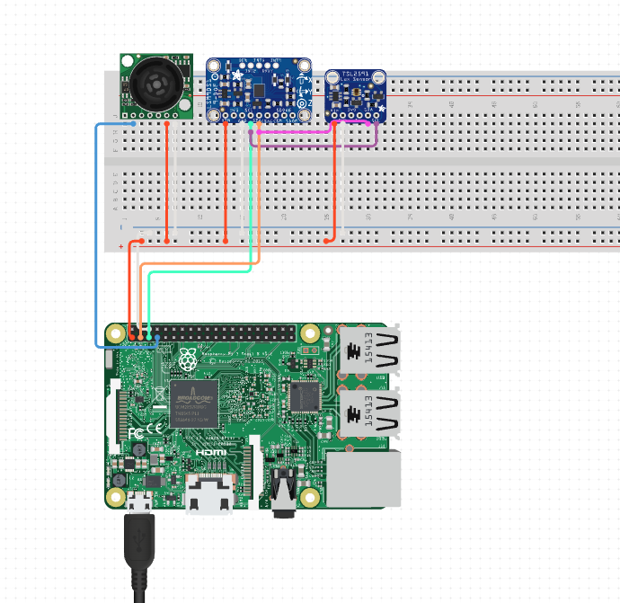

# Raspberry Pi 5 Sensor Setup Guide 🧙‍♀️✨

This document outlines the steps required to connect and program the LSM9DS1 (a 9DOF sensor with accelerometer, magnetometer, and gyroscope) and the TSL2591 (a high dynamic range digital light sensor) with a Raspberry Pi 5.

## Navigation Table ❤️🔥⚡

| Document Title              | Link                                                                                      |
|-----------------------------|-------------------------------------------------------------------------------------------|
| **Main Landing Page** ❤️✨  | [Readme.md](https://github.com/LilaShiba/flask_server_ubi/blob/main/readme.md)            |
| **Sensor Setup Guide** 🔥   | [build_instructions.md](https://github.com/LilaShiba/flask_server_ubi/blob/main/build_instructions.md) |
| **RPI Server Documentation**⚡| [RPI Server Documentation](https://github.com/LilaShiba/flask_server_ubi/blob/main/board_readme.md)    |
| **OS Choice** 🌟            | [os.md](https://github.com/LilaShiba/flask_server_ubi/blob/main/os.md)                    |

# 3/11 Update for Fedora IoT :) 

## Step 1: Enable I2C Interface on Raspberry Pi 🧙

1. Open a terminal window.
2. Run `sudo raspi-config`.
3. Navigate to `Interfacing Options` > `I2C` and enable it.
4. Reboot your Raspberry Pi for the changes to take effect.

## Step 2: Install Required Packages 📦

<pre><code>sudo apt-get update
sudo apt-get install -y i2c-tools python3-smbus python3-pip
pip3 install RPi.GPIO adafruit-circuitpython-lsm9ds1 adafruit-circuitpython-tsl2591
</code></pre>

## Step 3: Detect Connected I2C Devices 🔍

To find the I2C addresses of your connected sensors:

<pre><code>sudo i2cdetect -y 1
</code></pre>

Note the hexadecimal addresses displayed for your LSM9DS1 and TSL2591 sensors.

## Step 4: Programming the Sensors 🧙‍♀️🔮

### LSM9DS1 Sensor

1. Import the library:

   <pre><code>import adafruit_lsm9ds1</code></pre>

2. Create an I2C connection:

   <pre><code>from board import SCL, SDA</code></pre>

3. Initialize the sensor:

   <pre><code>
   import busio
   i2c = busio.I2C(SCL, SDA)

   sensor = adafruit_lsm9ds1.LSM9DS1_I2C(i2c)
   </code></pre>

4. Read sensor data:

   <pre><code>
   accel_x, accel_y, accel_z = sensor.acceleration  
   mag_x, mag_y, mag_z = sensor.magnetic
   gyro_x, gyro_y, gyro_z = sensor.gyro
   </code></pre>

### TSL2591 Sensor

1. Import the library:
   <pre><code>import adafruit_tsl2591</code></pre>
2. Initialize the sensor:
   <pre><code>sensor = adafruit_tsl2591.TSL2591(i2c)</code></pre>
3. Read sensor data:
   <pre><code>
   lux = sensor.lux

   infrared = sensor.infrared
   visible = sensor.visible
   </code></pre>

## Connection Diagram 📐✨

Below is a textual representation of how to connect the LSM9DS1 and TSL2591 sensors to the Raspberry Pi 5:

- **Raspberry Pi 5:**
  - GPIO 2 (SDA) to SDA pin on both LSM9DS1 and TSL2591
  - GPIO 3 (SCL) to SCL pin on both LSM9DS1 and TSL2591
  - 3.3V - 5V to VIN (or 3V3) on both sensors as they have 10K pullups
  - GND to GND on both sensors

  S

Please ensure that your connections are secure and that the sensors are correctly oriented.

## Conclusion 🌙✨

You have now successfully set up your Raspberry Pi 5 to communicate with the LSM9DS1 and TSL2591 sensors. This setup allows you to explore a wide range of applications, from environmental monitoring to gesture control, with these advanced sensors. Happy experimenting! 🧙‍♀️🌟

## Citation

Created in partnership with OpenAI :)
Thank goodness
