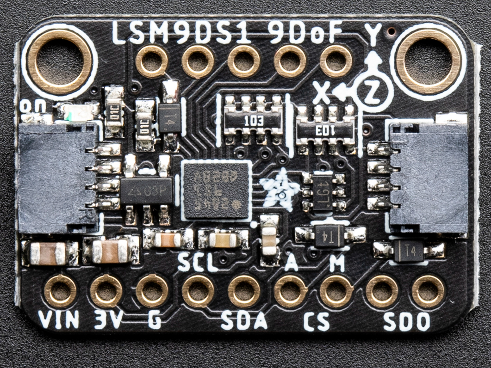
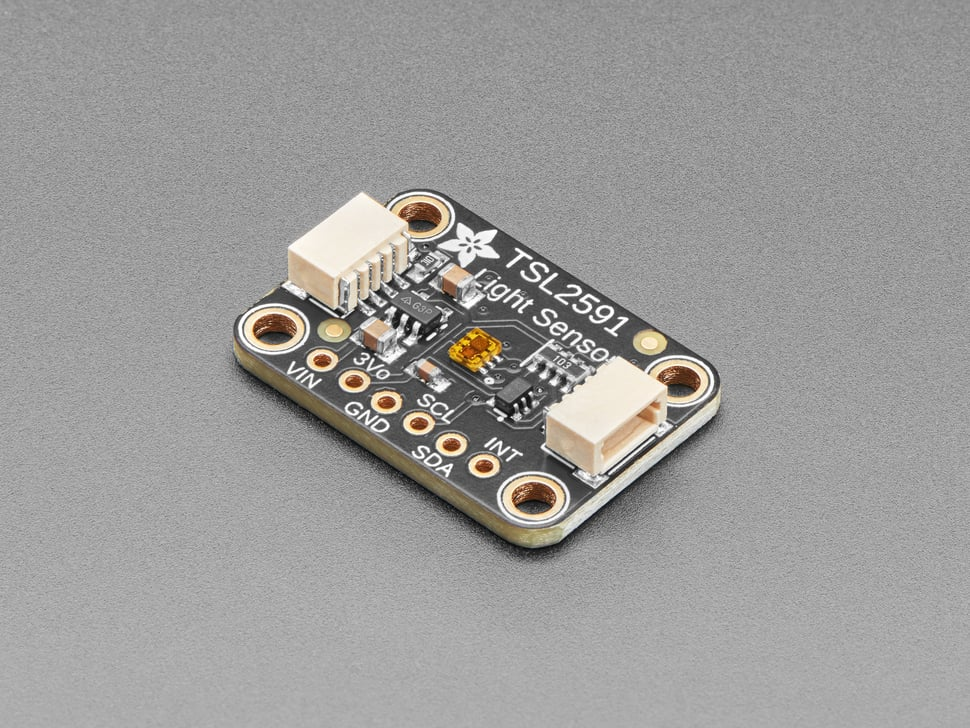
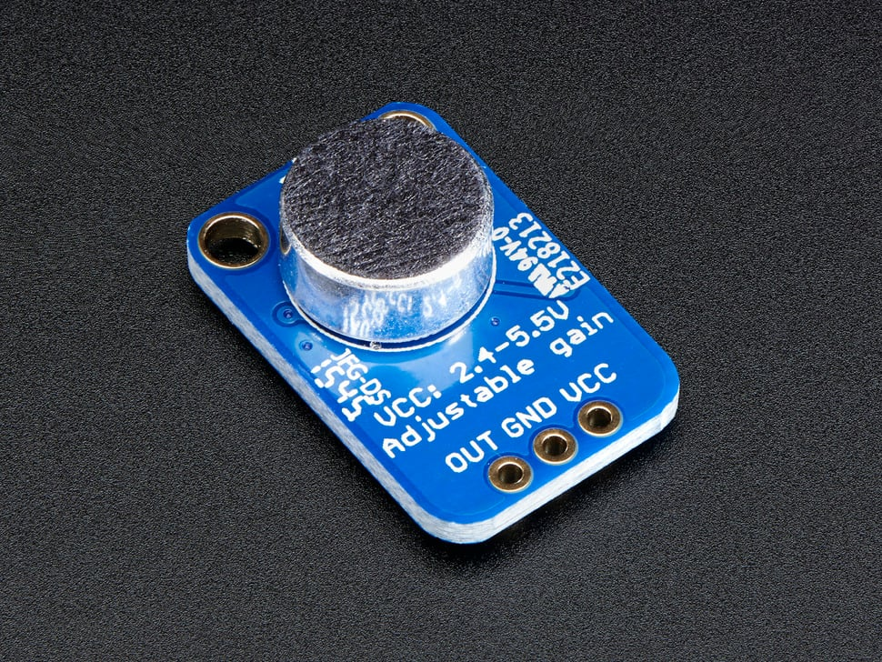
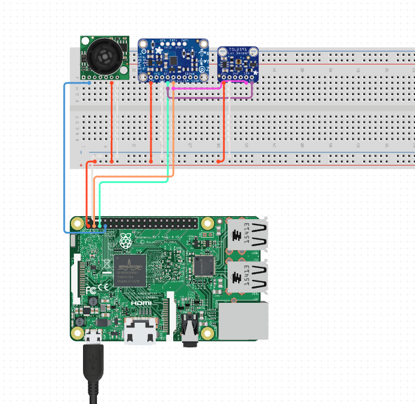

# 🌈🤖 RPI Server Documentation 🌟🔧

After research and experimentation with Raspbian, Ubuntu, and Fedora, Fedora IoT was selected for its lightweight and high reliability ratio. Raspbian presented many issues interfacing with I2C. Ubuntu was too clunky. FIoT was just right 🌟

Documentation for Raspbian is provided as it is only a matter of time before they fix these errors, mainly the remapping of the gpio module to rpi5s new structure.

## Navigation Table ❤️🔥⚡

| Document Title              | Link                                                                                      |
|-----------------------------|-------------------------------------------------------------------------------------------|
| **Main Landing Page** ❤️✨  | [Readme.md](https://github.com/LilaShiba/flask_server_ubi/blob/main/readme.md)            |
| **Sensor Setup Guide** 🔥   | [build_instructions.md](https://github.com/LilaShiba/flask_server_ubi/blob/main/build_instructions.md) |
| **RPI Server Documentation**⚡| [RPI Server Documentation](https://github.com/LilaShiba/flask_server_ubi/blob/main/board_readme.md)    |
| **OS Choice** 🌟            | [os.md](https://github.com/LilaShiba/flask_server_ubi/blob/main/os.md)                    |


## ✨ High Lvl Overview ✨


| Adafruit LSM9DS1 | Adafruit TSL2591 | MAX4466 |
|:----------------:|:----------------:|:-------:|
| **Accelerometer + Gyro + Magnetometer** | **Ultra-high-range luminosity sensor** | *Microphone** |
| [](https://learn.adafruit.com/adafruit-lsm9ds1-accelerometer-plus-gyro-plus-magnetometer-9-dof-breakout/pinouts) | [](https://learn.adafruit.com/adafruit-tsl2591) | [](https://learn.adafruit.com/adafruit-tsl2591) |


## Wiring

<a href="https://www.circuito.io/app?components=639,9443,44359,200000,779831"></a>

## 🛠 Connect Hardware 🧰

- **File Path:** `app/utils/rpi.py`
  - 🪄✨ This module acts as the bridge between your Raspberry Pi and the hardware components. It harbors all the functions needed to converse with sensors, actuators, and other devices tethered to your RPI.

## 🚦 Route Data 🛤

- **File Path:** `app/api/new_route.py`
  - 🌌 To expand app, add new routes, and register in app/__init__

## 🚀 Run App 🎮

- **From the Root Directory (Command Spells):**

  - Install packages

    ```
    pip3 install -r requirements.txt
    ```
  
  - Summon the Flask server into existence:

    ```
    python3 app.py
    ```

  - 🌟 This activates the Flask server.

## 📜 Check Logs 📚

- **Location:** `logs` folder
  - 📖 The logs can easily be added to any file by importing from the config folder

# 🔌 API Endpoints 🎇

## 🌡 Get Sensor Data 🌟

Note: All sensor IDs are numerical.

- **Request Example:**

  <pre><code>
  # GET /api/sensors?sensor_id=13&time_stop=45&hertz=50
  # Host: 127.0.0.1:8000
  http://127.0.0.1:8000//api/sensors?sensor_id=13&time_stop=45&hertz=50

  </code></pre>

```python
  import requests
  
  url = "http://127.0.0.1:8000/api/sensors"
  params = {
            'sensor_id': 1,
            'time_stop': 45,
            'hertz': 50
            }
  
  response = requests.get(url, params=params)
  
  if response.status_code == 200:
      print("Yay!")
      print(response.json())

```

- 📊 This snippet demonstrates how to query sensor data and control the hardware

## ⚙️ Get Actuator Status

Note: All actuator IDs are letters.

- **Request Example:**

  <pre><code>
  # GET /api/actuators?actuator_id=A HTTP/1.1
  # Host: 127.0.0.1:8000
  http://127.0.0.1:8000/api/actuators?actuator_id=A
  </code></pre>

```python  

  import requests
  
  url = "http://127.0.0.1:8000/api/actuators"
  params = {'actuator_id': 'A'}  # Note: Adjust the actuator_id as needed
  
  response = requests.get(url, params=params)
  
  if response.status_code == 200:
      print("Success:")
      print(response.json())
```

- 🛠 This example shows how to fetch the status of an actuator by its ID. It's crucial to replace the placeholder with the actual actuator ID in your requests.
