# 🌈🤖 RPI Server Documentation 🌟🔧

## OS Selection for RPI 🌟

After evaluating Raspbian, Ubuntu, and Fedora IoT (FIoT), Fedora IoT was chosen for its optimal balance of lightweight design and reliability. Raspbian encountered issues with I2C interfacing, and Ubuntu was deemed too resource-intensive. Documentation for Raspbian is retained in anticipation of future improvements.

## Documentation Links ❤️🔥⚡

- **Main Landing Page** ❤️✨: [Readme.md](https://github.com/LilaShiba/flask_server_ubi/blob/main/readme.md)
- **Sensor Setup Guide** 🔥: [build_instructions.md](https://github.com/LilaShiba/flask_server_ubi/blob/main/build_instructions.md)
- **RPI Server Documentation** ⚡: [RPI Server Documentation](https://github.com/LilaShiba/flask_server_ubi/blob/main/board_readme.md)
- **OS Choice** 🌟: [os.md](https://github.com/LilaShiba/flask_server_ubi/blob/main/os.md)

## High-Level System Overview ✨



### Sensor Integration

- **Adafruit LSM9DS1:** Accelerometer, Gyro, Magnetometer [Info](https://learn.adafruit.com/adafruit-lsm9ds1-accelerometer-plus-gyro-plus-magnetometer-9-dof-breakout/pinouts)
- **Adafruit TSL2591:** Ultra-high-range luminosity sensor [Info](https://learn.adafruit.com/adafruit-tsl2591)
- **MAX4466:** Microphone [Info](https://learn.adafruit.com/adafruit-tsl2591)

### Hardware Connection Guide

[Hardware Wiring Instructions](https://www.circuito.io/app?components=639,9443,44359,200000,779831)

## Development Guide 🛠🧰

### Connecting Hardware

- **Module:** `app/utils/rpi.py`
  - Acts as the bridge for communication with I2C sensors and devices connected to the Raspberry Pi.

### Expanding the Application

- **Module:** `app/api/new_route.py`
  - Implement new routes here and register them within `app/__init__.py`.

### Running the Application 🚀

1. Install dependencies:

## 🚀 Run App 🎮

- **From the Root Directory (Command Spells):**

  - Install packages

    ```
    pip3 install -r requirements.txt
    ```
  
  - Summon the Flask server into existence:

    ```
    python3 app.py
    ```

  - 🌟 This activates the Flask server.

## 📜 Check Logs 📚

- **Location:** `logs` folder
  - 📖 The logs can easily be added to any file by importing from the config folder

# 🔌 API Endpoints 🎇

# Sensor Data Collection API Documentation ✨🧙‍♀️✨

This documentation provides details on the `/sensors` endpoint of our Flask application, designed for initiating sensor data collection asynchronously, with sensors communicating over the I2C bus.

## Overview

Sensors connected via the I2C bus can be controlled and their data collected through this API. The I2C bus allows multiple sensors to be connected to the same bus lines, each sensor having a unique address.

## Registering Sensor Routes

To make the sensor data collection endpoint available, we first register it with a Flask `Blueprint`. This is accomplished in the `register_sensors_routes` function, which accepts a `Blueprint` instance as an argument.

<pre><code>def register_sensors_routes(api_bp: Blueprint) -> None:
    ...
</code></pre>

## Endpoint Details

- **URL:** `/sensors`
- **Method:** `GET`
- **Auth Required:** No
- **Permissions Required:** None

## Query Parameters

- `sensor_id` (int): The ID of the sensor to collect data from, corresponding to its I2C address. (Required)
- `time_stop` (int): Duration in seconds for how long the sensor data collection should run. (Required)
- `hertz` (int): The frequency at which data should be collected, affecting how data is read from the I2C bus. (Optional)

## Success Response

- **Code:** 200 OK
- **Content example:**

<pre><code>{
  "message": "Sensor run initiated"
}
</code></pre>

## Error Response

- **Code:** 400 BAD REQUEST
- **Content example:**

<pre><code>{
  "error": "Error description"
}
</code></pre>

## Example Queries

1. **Initiating Sensor Data Collection**

To start collecting data from a sensor with ID 1 for 60 seconds, send a GET request to the `/sensors` endpoint with the required query parameters:

<pre><code>GET /sensors?sensor_id=1&time_stop=60</code></pre>

2. **Specifying Data Collection Frequency**

To specify the frequency of data collection, include the `hertz` parameter in your query:

<pre><code>GET /sensors?sensor_id=1&time_stop=60&hertz=5</code></pre>

This request collects data from sensor ID 1 for 60 seconds at a frequency of 5 Hz.

## Notes on I2C Communication

- Sensors on the I2C bus are addressed using their unique I2C addresses. Ensure the `sensor_id` matches the sensor's I2C address.
- The I2C bus allows for efficient communication with multiple sensors, but care must be taken to manage bus traffic and avoid collisions.
- The `hertz` parameter can influence how often the I2C bus is queried, which is crucial for sensors that require time to refresh their data.

✨🧙‍♀️✨
